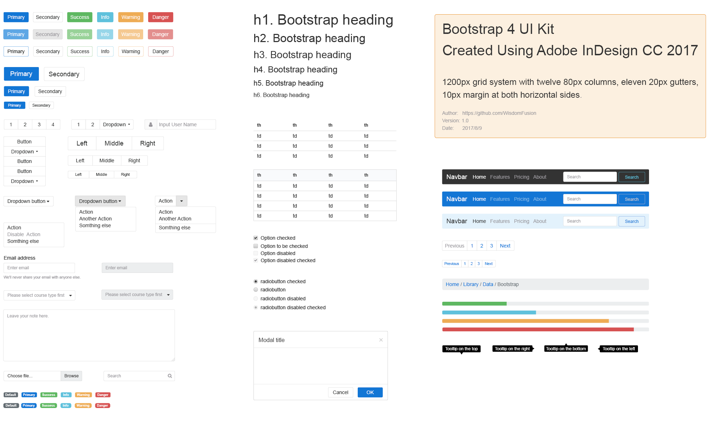

# Bootstrap 4 UI Kit for Adobe InDesign

Bootstrap 4 UI Kit created using Adobe InDesign CC 2017

As well as Bootstrap components, there is also a 1200px grid system, with twelve 80px columns, eleven 20px gutters, 10px margin at both horizontal sides.

The grid system abides by a formula: 80*12+20*11+10*2=1200px, which widely accepted by web designers and front end engineers.

Preview:

